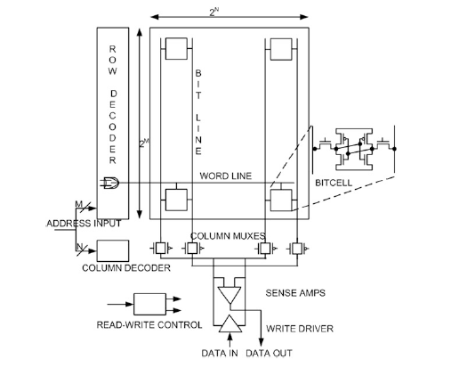
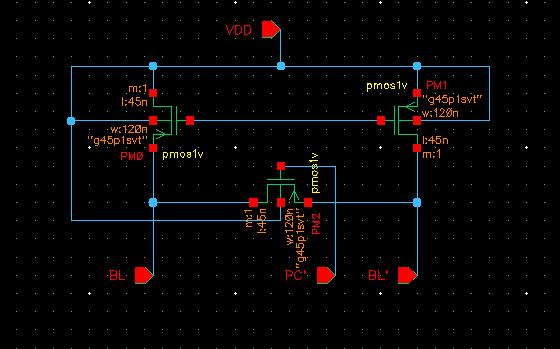
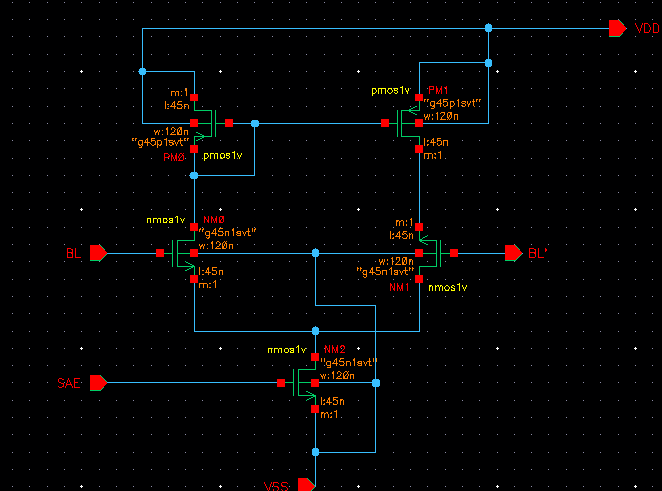
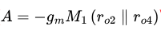
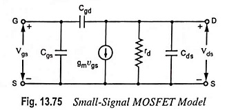
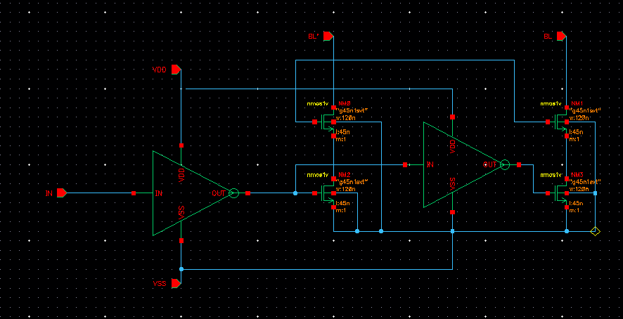
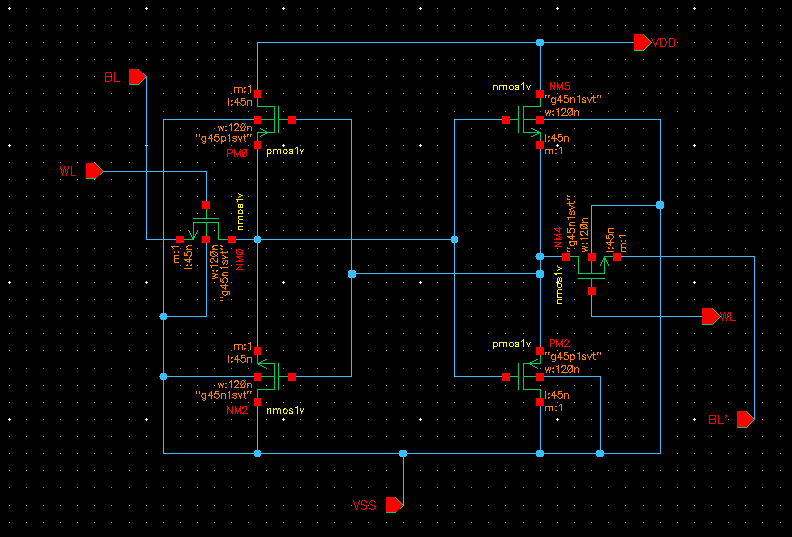
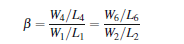
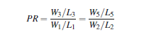

In this document I’ll show the required steps I took for designing SRAM circuit for each block circuit in Cadence Virtuoso 6.17
[NOTES]
Common SRAM array architecture:

Fig 1.SRAM Array Architecture

Each bitcell is capable of storing a single bit of information.

A standard six transistor SRAM bitcell consist of two cross coupled inverters and two access transistors connected to each data storage node.

The inverter pair forms alatch and holds the binary information.

When a wordline of a row is asserted logic HIGH,all the bitcells in the selected row become active and can be ready for read and write operations.

In order to decode m wordlines,one needs a log_2 m address bits.

An SRAM bitcell has three modes of operation:

1.  Read

2.  Write

3.  Standby

> So there are three different states such as reading,writing or data retention.

# Address Decoder

To implement an N-word memory where each word is M bits wide,a general approach is to arrange the memory words in a linear fashion.

In order to R/W,each word is selected with N select lines to access N independent locations.

This approach works for small memories,but puts in trouble if N is large(for larger memories).For instance,in a 32 Megabyte(2^25) word-oriented SRAM with a 32-bit(2^5) word width,N=2^20(N=1048576) select lines are needed-one for every word.

However for a 32 Megabyte bit-oriented SRAM,N becomes 2^25(33554432).Hencema larger number (~1 million) of a slelect lines or signals are needed to address thius word-oritented memory,if arranged in a linear fashion.

There are two types of decoders used in the SRAM,that is ,row decoder and the column decoder.The design of these decoders has a substantial impact on the SRAM performance and power consumption.Row decoders are needed to select one row of wordlines out of a set of rows in the array according to address bits,

While the column decoder select the particular bitline pairs out of the sets of bitline pairs in the selected row.

A fast decoder can be implemented using AND/NAND and OR/NOR gates.

The choice of a design style dependson the SRAM:

- Area

- Performance

- Power consumption

- Architectural considerations

> For large SRAM arrays where total address space is A0-A19 address bits.In this address space,row decoder requires 10 bits row decoder and 10 bits for column decoder.
>
> For the implementation of a row decoder 10-input NOR gate is needed per row.
>
> However for small single-block memories single stage row decoders are a good choice.
>
> Today most memories split the row decoder into several blocks decoded by separate decoder stages.
>
> 
>
> Fig 2.Divided wordline decoder

# Precharge circuit

In all SRAMs,for each column in the bitcell array there is a bitline pair(BL and complement of BL named primarly BL’ ).

Each pair of bitlines is connected to a precharge circuit.The function of this circuit is to pull-p the bitlines of a selected column to VDD level and perfectly equalize them before R/W operation.

Typical precharge circuit is shown in fig. 3:

Fig 3.Precharge circuit block for SRAM array

Transistor M1 and M2 connect the bitlines(BL and BL’) to VDD for pull-up,while transistor M3 equalizes both the bitlines.In a precharge circuit PMOS transistors are commonly used because they have good VDD passing capacity.

# Sense Amplifiers

Sense Amplifiers are one of the most important peripheral circuit in the CMOS SRAM , and become a separate class of circuits.

The primary function ofSA in SRAMs is to amplify a small differential voltage developed on the bitlines during Read accessand translate it to a full swing digital output signal.

A small differential voltage is developed by pulling down one of the precharged bitline by the read access bitcell.Due to small bitcell size and large bitlines capacitance,time required for read operation increases significantly,or in other words,read access time increases.

These circuits have strong impact on the read access time of amemory(orperformance),as they are used to retrieve the stored data in the memory array by amplifying a small signal variation on the bitline.

A sense amplifiers is characterized by the following parameters:

- Gain A

- Sensitivity S

- Current and voltage offsets Voff and Ioff

- Common mode rejection ratio CMMR

- Rise time Trise

- Fall time Tfall

- Sense delay Tsense

> The differential sensing is widely used to reject the common-mode noise that may be present on both the bitlines.This noise may be induced on both SA inputs or bitline pair(BL and BL’) due to power spikes,capacitive coupling between bitlines and between wordline and bitlines.
>
> The noise then attenuated by the value of CMMR and the true differential signal is amplified.
>
> 

Figure 4 shows a commonly used current-mirror differential sense amplifier which is formed by current mirror formed by M3 and M4(PMOS) and differential pair M1 and M2(NMOS)

Fig 4.Current-mirror differential sense amplifier

The gain of a current-mirror sense amplifier is given by relation typically set to around ten.:

gm_M1 – transconductance of transitor M1

r_o2 ,r_o4 = small signal output resistance of transistor M2 and M4.

The gain A is directly related to the width of transistor M2and M4 and can be increased by widening these transistor or by increasing the biasing current.

Function:

Sensing operation in this commonly used current mirror differential sense amplifier begins with setting up the SA Operating Point by preacharging and equalizing of the both the SA inputs,that is,the bitline pair(BL and BL’) of a selected column.Once both bitlines are precharged and equalized,wordline WL is asserted to activate the read accessed bitcells that started build-up of the differential voltage on the bitlines.Once the differential voltage exceeds the Sensitivity of the SA or overcomes the offset of SA,Sense Amplifier Enable(SAE) signal is issued to trigger the SA which amplifies the differential voltage caused by the bitcell(connecting one of the bitline to ground via one of the access and pull-down transistor) on the bitlines to full-swing digital output level. The read operation completes with the de-assertion of the SAE and WL.

Fig 5.Small signal MOS Model where rd=ro

Write drivers are used by a group of columns in an SRAM array to control the bitline pair(Bl and BL’) during write operation.As the bitline pair is precharged to VDD before every operation,the write driver has just to act the pull down oe of the two bitlines below the write margin of the SRAM cell during write operation according to the input data.

There are different types of write drivers commonly used in SRAM array,some of the typical write drivers commonly used in SRAM array ,some of the typical write driver circuits are shown below:

Fig 6.Transmission gate based write driver circuit.

The transmission based gate driver circuit is shown in Fig.6 is formed by two transmission gates(TG1 and TG2) and three inverter buffers(INV1-INV3)

Inverter buffer 2 and 3 writes data in to the bitlines(BL and BL’) via TG1 and TG2.

Write driver is enabled by the Write Enable(WE) signal and drives the bitlines to data in,

The TG1 and TG2 are activated by WE and its complementary WE’,as a result one fo the bitline is discharged through the NMOS transistor of either inverter(INV2 or INV3).

A successful write operatiuon is ensured in the SRAM bitcell by pulling down strength of INV2 and INV3 plays a significant role in the write operation.

Fig 7.Pass gates based write driver circuit

The write driver shown in Fig 7. Writes data through two stacked NMOS transistors,that is M1,M3 and M2,M4 which form two pass-transistor AND gates.

Write driver is enabled by the WE signal which activates the transistor M3 andM4,while data in enables the transistor M1 or M2 depending upon the input data through inverter buffers(INV1 and INV2)

When WE is enabled,one of the bitline(BL and BL’) is discharged from precharged level to ground through one of the transistor M1 or M2 depending upon the input data.

Fig 8.AND gate based write driver circuit

The write driver from fig 7 when WE is asserted ,the combination of WE and data in turn on one of the pass transistor M1 or M2.The discharge of one of these transistors,it discharges(BL or BL’) to ground.In SRAM architecture,only one write driver is needed per column in an SRAM array,as a result,write drivers can be upsized to discharge large capacitive bitlines for a successful and faster write operation.

# Bitline Leagake Current

During the read access when the wordline is activated and access devices are enabled,the bitcell read-current,I_read is the current sunk from the precharged bitline(BLB)

At lower operating voltages,I_read is significantly reduced due to lower gate-drive voltage,which implies that the read access time increases substantially.

The reduced read-current(I_read) and increased aggregate leakage current from the unaccessed bitcellsconnected to the same bitlines canmake conventional data sensing impractical.

The reduced I_read and increased aggregate leakage current also restrict the number of bitcells per bitline and makes the SRAM array less efficient,

In general,in standard 6T SRAM bitcell differential sense-amplifier is suedfor detecting a small drop on one of the bitlines,BL or BLB,differentialy with respect to the other bitline during the read cycle.Asmall drop in the BL or BLB is mainly due to the I_read,while other bitline is expectd to dynamically remain high.

Fig 9.Read and write stability examination under process variation(Butterfly curve)

(**a**) Statistical butterfly

curves simulated with intra-die variation at the nominal process corner in 32 nm technology node for read operation at *VDD* = 0.8 and *VDD* = 0.4V.

(**b**) Statistical butterfly curves simulated with intra-die variation at the nominal process corner in 32 nm technology node for write operation at *VDD* = 0.8 and *VDD* = 0.4 V.

# SRAM Bitcell Topology

Fig 10.Schematic of 6T SRAM bitcell.Internal data storage node Q at logic zero and QB at logic one,

## Read operation

In an ideal environment,it is assumed that the internal data storage nodes Q and QB are at 0 and 1,respectively ,which correspond to fig 10.To readthe bitcell contents,the following sequence of steps are performed:

1.  Conventionally to read a bitcell,the bitlines(BL and BLB) are precharged to the supply voltage VDD.In some SRAM designs these bitlines are precharged to intermediate level of 0 and VDD.

2.  The wordline(WL) is asserted to HIGH.

3.  Rise the WL from 0 to 1,result one of the bitcell sides(nodes) stores the logic 0;that side of the bitline is discharged through the pass-gate and pull down transistors.In standard 6T,as shown in Fig 10 transistors M1 and M4 discharges the precharged bitlines BL.

- If BLB goes to low,then the bitcell holds logic HIGH value,which corresponds to the Fig 11.a):

- If BL goes to low,then the bitcell holds a logic 0 value,which corresponds to Fig 11.b)

> 
>
> 
>
> Fig 11.Standard 6T SRAM bitcell under different stable states.
>
> a)SRAM bitcell 1 ; b)SRAM bitcell 0
>
> A destructive read operation can be prevented by ensuring a large enough bitcell ratio(B) ,in other words,pull-dow transistors(M4 and M6) must be stronger than the access transistors(M1 and M2).
>
> For a symmetric bitcell,bitcell ratio(B) is defined as:
>
> 
>
> In general,the bitcell ratio can be varied from 1.25 to 2.5 depending on the target application and desired static noise margin(SNM).

- A larger bitcell ratio makes the bitcell robust and provides higher SNM and read current I_read(and increasing speed),at expense of increased silicon overhead and leakage current.

- A smaller bitcell ratio,while maintain an adequate speed and noise margin,makes the bitcell compact for a high density cache design,but more vulnerable to process variation induced failures.

## Write Operation

The write operation of flipping the bitcell contents when initially assuming that the internal data storage nodes Q and QB are at 0 and 1,respectively as shown in Fig 11.b) consists of following sequence steps:

1.  Initially,wordline(WL)=0

2.  Precharge the bitlines(BL and BLB) to the supply voltage(VDD)

3.  After precharge,both the bitlines(BL and BLB) are disconnected from the supply voltage VDD

4.  Wordline(WL) is activated HIGH(data enters the bitcell during this step).

5.  Place the data value on the BL and the complementary data value on BLB

6.  The bitline BLB connected to the data storage node QB via M,is driven to the ground potential by a write driver through the M2 pass-gate transistor,while the BL is remained held at VD to pull node Q to HIGH via M1 pass gate transistor.

7.  As node Q and QB flip their states de-assert the wordline WL back to 0

It is important that a successful write operation primarily depends upon the properly sized pass gate transistors and pull up transistors.The pull up ratio(PR) for a symmetric SRAM bitcell is defined as:

A successful write operation can be guaranteed by choosing a lower PR value(generally,PR=1) that can be achieved by employing the wider or stronger pass gate transistors(M1 and M2) instead of pull up transistors(M3 and M5).

However,increasing the width of the pass gate transistors threatens the stability of the bitcell during the read cytlc,eor in other words reduces the read SNM of the bitcell.

# Write SNM Measurement

Fig 12.Experimental set-up for extracting the write static noise margin

During write operation M1(or M3) and M5(or M6) form a resistive voltage divider pulls Q below trip-point of inverter 2(INV2),a successful write operation occurs.The write ability of a SRAM bit cell can be gauged by the write SNM.

Bibliography

[1] Robust SRAM Deisgn https://picture.iczhiku.com/resource/eetop/wHkHQSDfgSqQfbVV.pdf

The write SNM is extracted by a combination of read voltage transfer characteristics (VTC) and the write VTC.

The read VTC is measured by sweeping the voltage at the storage node QB while monitoring the node voltage at Q.

The write VTC is measured by sweeping voltage at the storage node Q with BL and WL biased at VDD and BLB is biased at VSS while monitoring the voltage at node QB.

The WSNM can be quantified by the side of the smallest square fitted inside the R/W VRCs as shown in Fig 13:

Fig 13.Measurement of write static noisemargin(WSNM) of an SRAM bitcell obtained from read and write VTCs

\[TO BE CONTINUED….\]
